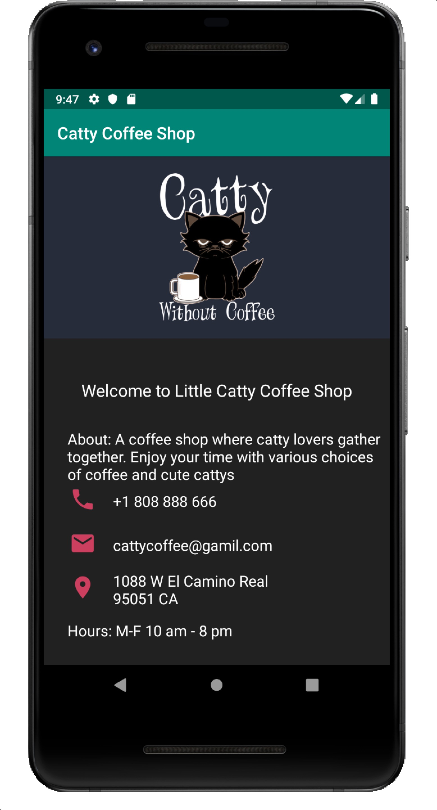

# Catty Coffee Shop
> MSSM Summer Project For Course 49786

[![NPM Version][npm-image]][npm-url]
[![Build Status][travis-image]][travis-url]
[![Downloads Stats][npm-downloads]][npm-url]

This app is a simple summer project for course 49786 which displays some basic
information of a local coffee shop such as address, contact & business hours.At current stage,
this app is a single screen app without additional interactive functionalities.



## Installation

OS X & Linux:

```sh
git clone project_url
```


## Usage example

Simply run the clone project in Android Studio to preview this single screen app


## Release History

*(Thanks @GenerousContributorName!)
* 0.1.0
    * The first proper release
    * Add Google Map Marker to the Address
* 0.0.1
    * Intialize the Coffee Shop Landing Page with contact, address and hours information

## Meta

About Author – [@ChufanXiao](https://github.com/seansio1995) 

Distributed under the MIT license. See ``LICENSE`` for more information.

[https://github.com/seansio1995](https://github.com/seansio1995)

## Contributing

1. Fork it (<https://github.com/yourname/yourproject/fork>)
2. Create your feature branch (`git checkout -b feature/fooBar`)
3. Commit your changes (`git commit -am 'Add some fooBar'`)
4. Push to the branch (`git push origin feature/fooBar`)
5. Create a new Pull Request

<!-- Markdown link & img dfn's -->
[npm-image]: https://img.shields.io/npm/v/datadog-metrics.svg?style=flat-square
[npm-url]: https://npmjs.org/package/datadog-metrics
[npm-downloads]: https://img.shields.io/npm/dm/datadog-metrics.svg?style=flat-square
[travis-image]: https://img.shields.io/travis/dbader/node-datadog-metrics/master.svg?style=flat-square
[travis-url]: https://travis-ci.org/dbader/node-datadog-metrics
[wiki]: https://github.com/yourname/yourproject/wiki
